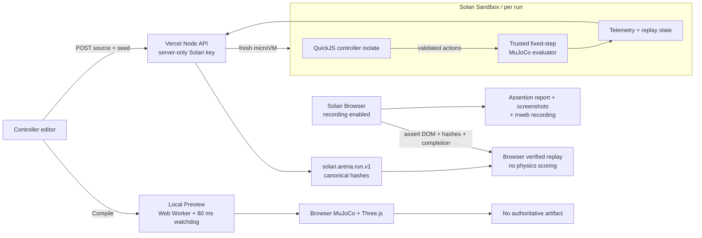

# Solari Agent Arena

> AI-generated robot controllers should be fast to preview locally, but isolated for authoritative evaluation.

Solari Agent Arena turns the existing Robot-3D-Sim open-field trainer into a focused controller-evaluation product. The original MuJoCo/Three.js arena remains the immediate **Local Preview**. A second path sends the exact controller source and seed to a server-side evaluator, runs the full fixed-step MuJoCo simulation inside a fresh **Solari Sandbox**, returns a versioned hash-bound artifact, and replays only recorded state in the browser.

The distinction is visible before the first run: **Local Preview is non-isolated and non-authoritative. Isolated Evaluation can issue evidence only after a real Sandbox run and confirmed teardown.**

## Trust boundary

The original controller is compiled with `new Function` inside a same-origin Web Worker. Its 80 ms step watchdog can terminate a hung worker and keep the UI responsive, but a Worker still has browser-origin capabilities, compilation itself was unbounded, and requestAnimationFrame/Worker scheduling affects action timing. It is not a security boundary and it cannot issue an authoritative result.

Solari materially changes that boundary:

- A Vercel Node function holds `SOLARI_API_KEY`; the browser never receives it.
- Every evaluation gets a fresh Solari Sandbox microVM and an unconditional teardown attempt.
- The trusted Node evaluator and fixed-step MuJoCo 3.12 runtime run inside that Sandbox.
- Submitted JavaScript runs only inside a separate QuickJS WASM runtime with memory, stack, per-step CPU, API, and output limits. It never executes in the evaluator's Node context.
- The server canonicalizes and hashes the returned result after the Sandbox command completes and records whether teardown was confirmed.
- The browser verifies artifact and telemetry integrity hashes, then renders recorded `qpos`/`qvel`; it does not rerun controller code or score physics.

This is not a claim of Solari remote attestation or signed issuance. The nested isolation metadata labels hardware isolation as a claim based on Solari product documentation and sets `attested: false`. The contract also records `attestation: "none"` and `networkPolicy: "not-enforced-no-egress-required"`: the evaluator needs no network because its lock-bound 7.9 MB dependency bundle is uploaded with the runner, but this integration does not attest that egress is blocked.

## Architecture



The detailed boundary and failure model are in [docs/ARCHITECTURE.md](docs/ARCHITECTURE.md).

## Authoritative evaluation flow

1. The API validates source size, controller shape, and a uint32 seed, then computes the controller SHA-256.
2. It creates a fresh Solari Sandbox with bounded CPU/memory and kill-on-idle cleanup.
3. It uploads the commit-pinned runner, frozen MJCF model, input, lockfiles, and a hash-recorded offline MuJoCo/QuickJS dependency bundle without shell interpolation.
4. The Sandbox unpacks that bundle without registry access and starts the evaluator with a 30 s command deadline. Its 90 s idle timeout is a distinct cleanup backstop, not a controller deadline.
5. QuickJS compiles and invokes `control(robot, dt)` under a 12 ms interrupt deadline. Results are JSON-size-limited, schema-filtered, finite-checked, and clamped before MuJoCo receives them.
6. MuJoCo advances at 2 ms for a fixed 8.00 s. A seed-derived initial yaw, checkpoints, collisions, telemetry, energy, and replay state are recorded.
7. The Sandbox is killed in `finally`. Only after creation, a structured runner outcome, and confirmed teardown does the server emit `solari.arena.run.v1`. Infrastructure or teardown failures return HTTP 502 and mint no authoritative artifact.
8. The browser independently verifies both hashes before enabling replay.

## Evidence contract

Every run contains:

- schema version and run ID;
- controller SHA-256 and uint32 seed;
- Solari product, SDK, template, hashed Sandbox ID, isolation/runtime, runner/model hashes, deadlines, wall time, and teardown result;
- outcome, reason, and an explicit `hostImpactAssessment: "not-measured-per-run"` proof boundary;
- checkpoints, score, simulated time, collisions, distance, top speed, and energy;
- replay/telemetry samples plus their SHA-256;
- a canonical full-result SHA-256.

See [docs/EVIDENCE_CONTRACT.md](docs/EVIDENCE_CONTRACT.md) and [`src/evidence/contract.ts`](src/evidence/contract.ts).

## Qualification and proof

| Case | Expected boundary result | Targeted local proof | Retained Solari evidence |
|---|---|---|---|
| Valid controller | Normal completion; 4/4 checkpoints; deterministic telemetry hash for identical seed | `arena-runner.test.ts` repeats seed 42 and compares full metrics/hash | **PENDING** — target: `public/evidence/valid.solari-run.json` + Browser bundle |
| Hanging controller | QuickJS interrupt; bounded timeout; Sandbox killed; next valid run unaffected | Infinite loop exits runner with code 124 | **PENDING** — target: `public/evidence/hanging.solari-run.json` |
| Capability attempt | QuickJS has no `process`; contained ReferenceError maps to `capability_violation` | Benign `process.exit(17)` probe fails inside only the sealed runner | **PENDING** — target: `public/evidence/capability-attempt.solari-run.json` |

Local tests prove evaluator logic and deterministic physics on the development host. They do **not** substitute for live Solari qualification. Live artifacts and Solari Browser evidence are only checked in after real SDK runs. Current evidence status is tracked in [docs/QUALIFICATION.md](docs/QUALIFICATION.md).

## Solari Browser is a verifier

`scripts/verify-deployment.mjs` uses a real recording-enabled Solari Browser session to:

1. open the deployed artifact URL;
2. independently hash the local authoritative artifact;
3. compare rendered run ID, controller hash, outcome, checkpoints, score, time, collisions, telemetry hash, and result hash;
4. start replay and wait for the explicit `COMPLETE` state;
5. retain `assertions.json`, loaded/final screenshots, the downloaded rrweb NDJSON recording, and hashes.

A screenshot by itself is not treated as proof.

## Exact Solari components

| Component | Why it is necessary |
|---|---|
| **Solari Sandbox** (`@solarisdk/sandbox` 0.1.2) | Supplies the fresh hardware-isolated outer execution boundary and bounded teardown for untrusted controller evaluation. |
| **Solari Browser** (`@solarisdk/browser` 0.1.2) | Verifies that the deployed public replay faithfully renders the authoritative artifact and retains a session recording. |
| Solari Desktop | **Not used.** The evaluator is headless and the existing WebGL UI is already the correct visual surface; Desktop would add cost and no proof. |

QuickJS is an in-guest controller/evaluator boundary, not a Solari product and not a replacement for the Sandbox.

## Local setup

Requirements: Node 22+ and, for live isolated runs, a Solari API key.

```bash
npm ci
npm test
npm run dev
```

Copy `.env.example` to `.env.local` only for local server/deployment tooling. Never use a `VITE_` prefix for the Solari key. Vite alone serves Local Preview; use `vercel dev` when exercising `/api/evaluate`.

```bash
npx vercel dev
```

Targeted evaluator qualification does not require a Solari key:

```bash
npm run qualify:local
```

`server/runner/runner-dependencies.tgz` is the checked-in offline evaluator bundle. After deliberately changing a pinned MuJoCo/QuickJS dependency, regenerate it with `npm run bundle:runner`; CI executes the bundle itself, without `npm install`, to prove the uploaded bytes are runnable.

## Deployment

The app targets Vercel because an authenticated Node function is required. Set these encrypted server-side environment variables in Vercel:

```text
SOLARI_API_KEY=slr_live_...
SOLARI_SANDBOX_TEMPLATE=base
SOLARI_EVALUATION_ENABLED=false
SOLARI_EVALUATION_TOKEN=generate-a-separate-demo-access-code
```

Keep paid public evaluation disabled by default. Enabling it also requires a separate admission code, entered by the reviewer at run time, and the function permits only one concurrent run per warm instance. This code is not a Solari credential. Checked-in integrity-verified replays remain public when live runs are paused. Build and deploy:

```bash
npm test
npm run build
npx vercel deploy --prod
```

GitHub Actions runs the full local suite/build on every change. The manual **Solari Browser proof** workflow uses a repository secret and uploads the proof bundle.

## Relationship to Robot-3D-Sim

This repository preserves the two-commit history and MIT attribution of [EXO-Robotics/Robot-3D-Sim](https://github.com/EXO-Robotics/Robot-3D-Sim) through clean `main` commit `cf0eec20d6754161683112d3b43f97c394f5b966`. It deliberately does not import the unrelated, untracked benchmark/export workspace or turn into a general Robo Olympics platform.

Reused work includes the original MuJoCo WASM model, Three.js robot/arena renderer, local controller editor, Worker/watchdog, command filtering, telemetry, visual assets, and build tests. The submission adds the explicit trust split, authoritative server/Solari path, deterministic evidence contract, replay-state restoration, qualification fixtures, proof workflow, and focused product presentation.

## Proof boundaries

- Local Preview is real MuJoCo contact simulation, but it is an assisted trainer and non-authoritative.
- Browser replay renders frozen authoritative state; it does not prove or redo scoring. Its public check is unsigned hash integrity, not cryptographic issuer authentication.
- `sandboxTerminated: true` means the SDK teardown call completed; it is not a cryptographic destruction attestation.
- Per-run evidence says host impact is not measured. The live qualification's valid → failures → valid sequence proves evaluator-service recovery, not general malware analysis or physical-host forensics.
- The hostile fixture is intentionally benign: it probes a missing capability and never creates destructive malware.

License: MIT. Original attribution and history are preserved.
