# Solari Agent Arena

> Let an AI agent see a robot, control it through bounded tools, and cross an obstacle course. Preview instantly in the browser; score only by deterministic replay inside Solari.

[Live arena](https://solari-agent-arena.vercel.app/) · [Authoritative agent replay](https://solari-agent-arena.vercel.app/?evidence=%2Fevidence%2Fvalid-agent.solari-run.json) · [Frozen agent E2E proof](evidence/agent-e2e/0472ad47-5a2c-4c7f-9dd5-a590ada0880d/assertions.json) · [Architecture](docs/ARCHITECTURE.md)

Solari Agent Arena turns [Robot-3D-Sim](https://github.com/EXO-Robotics/Robot-3D-Sim) into an embodied-agent benchmark. A local model, Codex, or browser-driving agent controls the same MuJoCo/Three.js arena as the human reviewer through four page tools or a seven-tool recording MCP bridge. The frozen official route has five checkpoints; practice and local routes can define other bounded checkpoint sequences.

The browser trial is deliberately **non-authoritative**. The only authoritative score comes from replaying the validated action transcript with fixed-step MuJoCo inside a fresh **Solari Sandbox**, then binding the result, telemetry, replay state, course, seed, and transcript to SHA-256 evidence.

## The product in two clicks — after one connection

A pasted prompt cannot attach tools to an already-running Codex task. On the first use of a cloned checkout, save `SOLARI_API_KEY` in `.env.local`, run `npm run setup:codex`, and restart Codex. The installer stores only absolute paths in Codex MCP configuration; it does not copy the key. Codex desktop, CLI, and IDE share that host configuration. This follows the [official Codex MCP setup model](https://learn.chatgpt.com/docs/extend/mcp?surface=cli).

1. Open the arena and choose an official, practice, or locally imported course.
2. Click **Copy mission & enter arena**, paste the mission into a connected Codex task or local model, and let it use the exposed tools.

The copied mission starts with a connection preflight and does not pretend that a Safari tab is shared with a new Codex task. It includes an exact recovery instruction when tools are absent, every tool’s role, course coordinates, action limits, the MuJoCo equations/timing, and the finish condition. The simulation clock is frozen while the model looks or thinks. For an official course, `RUN ISOLATED SCORE` submits only the transcript and seed; the external agent itself is **not** claimed to run inside Solari.

A fresh Solari Sandbox replays the transcript through the frozen deterministic gait and MuJoCo model, scores it, emits `solari.arena.agent-run.v1`, and is killed before authority is issued. The browser verifies artifact hashes and replays recorded `qpos`/`qvel`; it never rescores the run.

## Course library

The picker currently contains one frozen official benchmark and two practice routes. Users can import a bounded `solari.arena.course.v1` JSON route using the [course template](public/course-template.json). Imports update the live checkpoint path and the copied agent prompt, but run locally on the fixed physics arena.

Imported routes are deliberately **not authoritative**. Community publishing, immutable versioning, moderation, and server-side course registration must exist before an uploaded course can mint a comparable Solari score. The UI says “local trial only” and disables isolated scoring for these routes rather than overstating the boundary.

## Why Solari matters

Robot-3D-Sim originally runs generated controller code in a same-origin Web Worker. Its 80 ms watchdog helps responsiveness, but a Worker is not a security boundary: it retains browser-origin capabilities, compilation is not time-bounded, and worker scheduling changes when cached commands reach physics. That path remains visible as **Local Preview / non-isolated / non-authoritative**.

Solari adds two necessary boundaries:

- **Solari Sandbox** is the outer microVM boundary for authoritative deterministic simulation. Controller-source qualification still nests submitted JavaScript in QuickJS; agent benchmarking accepts no model code at all, only a schema-validated bounded action transcript.
- **Solari Browser** performs release verification. It drives the same public page callbacks used by the site tools, proves observation consumes zero simulated time, completes the browser course, compares the transcript to the authoritative artifact, verifies every rendered result field and hash, completes replay, and retains screenshots plus the rrweb session recording. A separate contract test verifies the WebMCP registration surface and delegation.

There is no Solari Desktop integration. This evaluator is headless and the existing WebGL arena is already the correct visual surface.

## Architecture

```mermaid
flowchart LR
  A[Local model / Codex / agent]
  A -->|Codex site tools| WM[WebMCP on live page]
  A -->|standard stdio MCP| MB[Local MCP bridge]
  MB -->|server-side API key| SB[Solari Browser]
  A -->|Safari computer use| UI[Accessible arena controls]
  WM --> BT[Browser Agent Tool Trial]
  SB --> BT
  UI --> BT
  BT -->|reset / observe / bounded act| BM[Browser MuJoCo + Three.js]
  BM --> TR[solari.arena.agent-transcript.v1]
  TR -->|POST + admission token| API[Vercel Node API<br/>Solari key server-side]
  API --> SS
  subgraph SS[Fresh Solari Sandbox]
    V[Validate canonical transcript]
    M[Fixed gait + MuJoCo 3.12<br/>2 ms authoritative simulation]
    E[Score + telemetry + replay state]
    V --> M --> E
  end
  E --> AR[solari.arena.agent-run.v1<br/>hash-bound evidence]
  AR --> RP[Browser integrity check + recorded replay]
  VR[Solari Browser release verifier] -->|numeric form + DOM + hashes + completion| RP
```



The trust claim is intentionally narrow: **the external model is outside the isolated boundary**. Sandbox authority covers validated transcript replay and scoring. A manipulated browser trial cannot mint an authoritative score.

## Agent tool surfaces

### Codex built-in browser: site tools

Open the [live agent arena](https://solari-agent-arena.vercel.app/?agent=1) in Codex’s built-in browser. The top-level page registers these WebMCP site tools:

| Tool | Effect |
|---|---|
| `arena_reset(seed)` | Reset to a uint32 seed and return the initial observation. |
| `arena_observe()` | Read pose/progress without advancing simulated time. |
| `arena_act(drive, turn, durationMs)` | Advance one bounded action and return the resulting observation. |
| `arena_transcript()` | Return the exact bounded controller artifact for isolated scoring. |

Codex can discover site tools only when the page is opened inside the browser surface attached to that same task. A Safari tab or a page opened in another task is not a tool connection. Current OpenAI setup/availability details are in the [official site-tools documentation](https://learn.chatgpt.com/docs/webmcp).

### Local models or Codex CLI: standard MCP bridge

The checked-in stdio server launches a recording-enabled Solari Browser and exposes `arena_open`, `arena_reset`, `arena_observe`, `arena_look`, `arena_act`, `arena_transcript`, and `arena_close`. Start with `arena_open({ seed, courseId })`; `courseId` is allow-listed to the three built-in versioned routes and the returned observation must match it before the agent acts. `arena_reset` reuses the active Browser session, while `arena_look` and every action return both structured state and a PNG view. Closing can retain the transcript, final screenshot, rrweb replay, and hash receipt under this repository's `evidence/agent-sessions/` directory regardless of the model host's working directory.

For Codex, save the key in `.env.local`, then run the idempotent connector from the repository root:

```bash
npm run setup:codex
```

Then restart Codex and inspect `/mcp`. The repository also contains a project-scoped `.codex/config.toml` for trusted tasks opened directly on the checkout. Codex’s official stdio/config options are documented in [Model Context Protocol](https://learn.chatgpt.com/docs/extend/mcp?surface=cli). Any local model host that supports stdio MCP can use the Node command shown by `codex mcp get solari-agent-arena --json` after setup.

The MCP bridge reads `SOLARI_API_KEY` only in its local Node process. The visited page never receives it. `arena_open` is origin-locked to `ARENA_URL` (production by default); set that variable deliberately to use a local or alternate deployment.

Built-in course selection travels as an explicit contract: copied prompt → `arena_open.courseId` → normalized `?agent=1&course=...` URL → first observation. Arbitrary requested query strings are discarded, unknown IDs fail closed, and the copied prompt tells the agent to stop with `ARENA_COURSE_MISMATCH` if the first observation differs. Locally imported course manifests intentionally remain same-tab, non-authoritative trials; an ID alone is insufficient to reconstruct or validate their geometry through the MCP bridge.

### Safari or ordinary browser automation

The Agent Tools panel exposes accessible buttons and status fields. Browser automation may also call the same frozen API at `window.solariAgentArena`. Safari does not provide Codex site tools; a local model needs computer-use/browser automation or the standard MCP bridge.

The in-app **Tools & physics** drawer explains where each interface appears, lists all seven MCP operations, provides a copyable setup command, and shows the exact fixed-step dynamics used by the benchmark. The manual numeric action console stays collapsed unless a developer or verifier opens it.

## Tool and transcript contract

- Schema: `solari.arena.agent-tools.v1` and `solari.arena.agent-transcript.v1`.
- Frozen course: `arena-slalom-ramp-v1`, five sequential circular checkpoints.
- Budget: 60 simulated seconds, 120 actions.
- Action limits: drive ±1.6, turn ±1.4, duration 100–2,000 ms.
- Thinking cost: zero simulated time between calls.
- Determinism: seeded start yaw, trusted gait targets, 10 ms control updates, 2 ms MuJoCo step.
- Authority: transcript sequence, fields, finiteness, limits, total time, seed, and course ID are revalidated server-side and again inside the runner input boundary.

The valid qualification transcript completes 5/5 checkpoints in 21 actions, 26.124 simulated seconds, and zero collisions.

## Evidence contracts

`solari.arena.agent-run.v1` contains at minimum:

- run ID, transcript/controller SHA-256, seed, external-agent label and explicit `external-not-isolated` runtime;
- Solari SDK/product/template, hashed Sandbox ID, runner/model/course/dependency hashes, deadlines, wall time, and confirmed teardown;
- authoritative-boundary label `validated-transcript-replay-and-scoring`;
- outcome, checkpoints, score, simulated time, collisions, distance, speed, energy, and actions used;
- per-action receipts, replay/telemetry state and hash, and canonical full-result hash.

For an agent run, `controllerHash` equals `transcriptHash` because the bounded action transcript is the exact effective controller artifact being judged. Controller-source runs retain `solari.arena.run.v1`, where `controllerHash` hashes the submitted JavaScript source.

Both contracts are unsigned integrity artifacts, not remote attestation. `sandboxTerminated: true` means the SDK kill completed; it is not cryptographic destruction proof. See [docs/EVIDENCE_CONTRACT.md](docs/EVIDENCE_CONTRACT.md).

## Concise proof table

| Claim | Proof | Boundary |
|---|---|---|
| Browser thinking costs zero simulated time | Browser E2E observes time 0, waits 750 ms wall time, observes time 0 | Browser behavior, not authority |
| Local-model MCP bridge works against production | Real stdio MCP handshake lists seven tools, proves reset plus zero-cost observation and exact 800 ms action, completes the 21-action 5/5 course, then retains a hash-bound screenshot/rrweb receipt | Tool transport and presentation, not scoring authority |
| Agent course can be completed | Valid transcript: 5/5, 21 actions, 26.124 s, 0 collisions | Local deterministic runner + live Sandbox |
| Agent score is repeatable in Solari | Two fresh Sandboxes produce identical physics metrics and telemetry hash `f87f2653…71dfbcf` | Same frozen Sandbox evaluator environment |
| Hanging generated controller is bounded | QuickJS interrupt → timeout, Sandbox killed | Controller-source qualification path |
| Benign Node capability probe is contained | `process` unavailable → capability violation, Sandbox killed | Controller-source qualification path |
| Failure cases do not poison the service | valid → hang → capability probe → valid reproduces telemetry/metrics | Tested service recovery, not host forensics |
| Public UI matches authority | Solari Browser compares all fields/hashes and reaches replay `COMPLETE` | Deployed presentation fidelity |

Retained artifacts live in `public/evidence/`, `evidence/e2e/`, `evidence/agent-e2e/`, and `evidence/mcp/`. See [docs/QUALIFICATION.md](docs/QUALIFICATION.md) for exact IDs and hashes.

## Local setup

Requirements: Node 22+. A Solari key is needed only for live Sandbox/Browser operations.

```bash
npm ci
npm test
npm run build
npm run dev
```

Copy `.env.example` to `.env.local` for server-side/local bridge tooling:

```text
SOLARI_API_KEY=slr_live_...
SOLARI_SANDBOX_TEMPLATE=base
SOLARI_EVALUATION_TOKEN=separate-demo-admission-code
SOLARI_EVALUATION_ENABLED=false
```

Never prefix the Solari key with `VITE_`. Vite alone serves the browser trials; use `vercel dev` for `/api/evaluate` and `/api/agent-evaluate`.

Useful commands:

```bash
npm run qualify:local
npm run qualify:solari-agent
npm run setup:codex
npm run agent:mcp
npm run verify:mcp-bridge
npm run verify:agent-benchmark
```

## Deployment

The public deployment uses Vercel because Solari credentials and evaluation admission must stay in a Node function:

```bash
npx vercel env add SOLARI_API_KEY production --sensitive
npx vercel env add SOLARI_EVALUATION_TOKEN production --sensitive
npx vercel env add SOLARI_SANDBOX_TEMPLATE production
npx vercel env add SOLARI_EVALUATION_ENABLED production
npx vercel deploy --prod
```

Keep `SOLARI_EVALUATION_ENABLED=false` on unattended public deployments. Checked-in authoritative replays stay public; paid live evaluation requires deliberately enabling it plus the separate admission token. The admission token is not a Solari credential.

The API deliberately makes no in-process “one run at a time” claim: Vercel instances do not share memory. Before enabling live evaluation for multiple reviewers, add an account-level Solari quota and a durable distributed rate/lease control. The checked-in public deployment remains disabled.

## Relationship to Robot-3D-Sim

This repository preserves the clean `main` history and MIT attribution of Robot-3D-Sim through commit `cf0eec20d6754161683112d3b43f97c394f5b966`. It reuses the MuJoCo WASM model, Three.js robot/arena renderer, controller editor, Worker/watchdog, telemetry, visual assets, and build tests.

The focused Solari submission adds the visible trust split, agent tool benchmark, deterministic transcript contract, WebMCP and stdio MCP surfaces, server-only Sandbox authority, hash-bound evidence/replay, qualification fixtures, and recording-enabled Browser verification. It deliberately does not import unrelated simulator branches or become a general Robo Olympics platform.

License: MIT. Original attribution and Git history are preserved.
