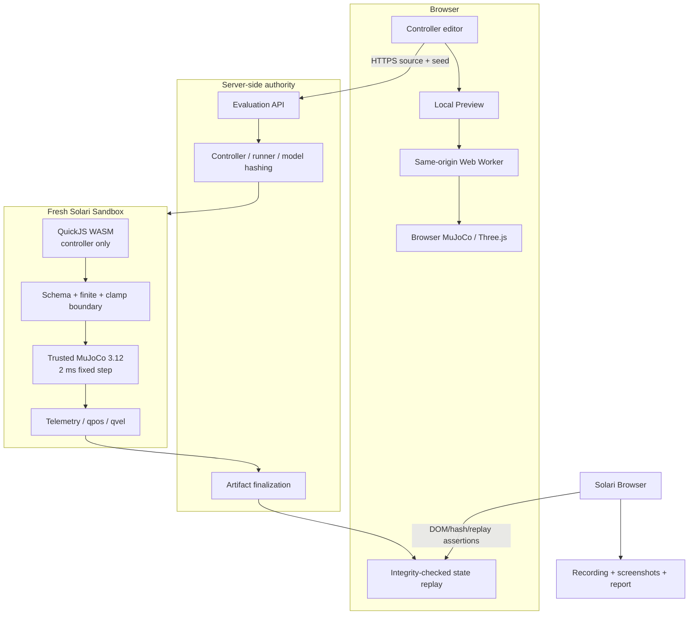

# Architecture and trust boundaries

## Product split

## Boundary inventory

| Boundary | What it guarantees | What it does not guarantee |
|---|---|---|
| Browser Worker | UI responsiveness and termination of a slow step | Origin isolation, compile timeout, authority, deterministic scheduling |
| Vercel API | Server-only credential handling, request bounds, artifact finalization | Untrusted-code isolation by itself |
| Solari Sandbox | Fresh microVM outer boundary and SDK-controlled destruction | Publicly documented egress policy or remote attestation |
| QuickJS inside Sandbox | Controller lacks Node/browser APIs; CPU/memory/stack bounds | Hardware isolation from the service host |
| Artifact hashes | Detect mutation between issuance and replay | Prove who operated the server without a signing/attestation system |
| Solari Browser | Deployed DOM/evidence/replay behavior matches the artifact | Recompute MuJoCo physics or replace the authoritative evaluator |

## Authority rule

Only `solari.arena.run.v1` emitted after a real Sandbox was created, a structured evaluator outcome was returned, and teardown was confirmed is an authoritative arena artifact. Sandbox creation, upload, unpack, or teardown failure returns no artifact. Browser Local Preview output, local runner output, screenshots, and CI unit tests never satisfy that rule.

## Failure containment

- Controller source is never passed through a shell.
- QuickJS owns compilation and calls; the trusted Node global is not exposed.
- Each call has an interpreter interrupt deadline, result byte limit, and finite/schema filter.
- Dependencies are uploaded as a hash-recorded offline bundle; registry egress is not needed during evaluation.
- The Sandbox command has a 30 s SDK timeout; the 90 s Sandbox idle timeout is a separate cleanup backstop.
- Teardown is attempted in `finally` on success, rejection, timeout, or infrastructure failure.
- Structured controller failures issue a zero-telemetry contract. Infrastructure or unconfirmed-teardown failures issue no authoritative contract.
