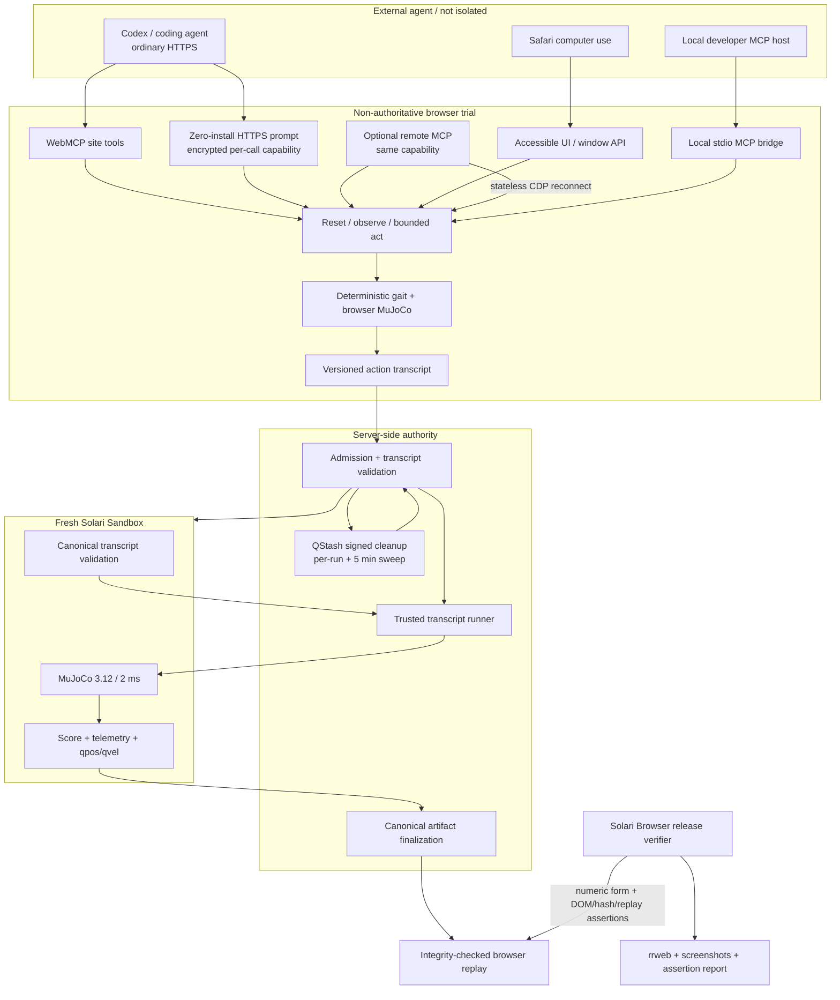

# Architecture and trust boundaries

## Product split

The external agent may be local, remote, benign, broken, or adversarial. This submission does not claim to isolate that model. It turns the model's effect into a bounded data artifact; only transcript replay and scoring are authoritative inside Solari.

## Execution paths

| Path | Purpose | Authority |
|---|---|---|
| Local Preview | Fast generated-controller iteration through the original Worker/watchdog | Non-isolated and non-authoritative |
| Hosted Agent Practice | One copied system prompt controlling a recording Solari Browser through strict HTTPS operations and a short-lived encrypted capability; MCP remains optional | Provider-isolated from the user's machine, but non-authoritative because the page owns simulation state |
| Agent Tool Trial | Visual observe/act loop, zero-cost thinking, exact transcript capture | Non-authoritative; page/client can be manipulated |
| Agent Isolated Score | Validate and replay the action transcript in fixed-step MuJoCo in a fresh Sandbox | Authoritative for transcript replay and scoring only |
| Controller Isolated Evaluation | Run submitted controller source in QuickJS plus MuJoCo in a fresh Sandbox | Authoritative for the controller-source run |
| Browser Replay | Render integrity-checked recorded state | Presentation of authority, not new scoring |

## Course authority

The browser course library has three states:

| Course source | Browser tools | Solari score |
|---|---|---|
| Frozen official registry | Enabled | Eligible after transcript validation and Sandbox replay |
| Built-in practice route | Enabled | Disabled |
| Locally imported `solari.arena.course.v1` route | Enabled on the fixed arena | Disabled |

Local imports are checkpoint-route manifests, not arbitrary MuJoCo or JavaScript uploads. They are size/range/count validated in the browser and never reach the authoritative evaluator. A future community registry needs immutable course IDs/versions, moderation, bounded geometry, server-side validation, and a course hash in the authority bundle before uploaded level designs can produce comparable scores.

For the primary HTTPS path, Safari passes the allow-listed `courseId`, seed, and track to the server before it copies anything. The server creates a normalized same-origin `?agent=1&course=...` URL, verifies the loaded manifest and initial observation, and seals that binding into the prompt's ticket. The agent must match the first observation before acting. Local imports are not silently substituted because their manifests exist only in the importing tab. The optional stdio MCP path keeps its explicit `arena_open.courseId` binding.

## Boundary inventory

| Boundary | What it guarantees | What it does not guarantee |
|---|---|---|
| Browser Worker | UI responsiveness and termination of a slow controller step | Origin isolation, compile timeout, authority, deterministic scheduling |
| WebMCP / window API / accessible buttons | A narrow shared robot-control interface | Trustworthiness of the agent or browser state |
| Hosted admission lease | Atomic holder/IP/global daily and concurrency limits; one-time pairing; active revocation; raw IPs are HMAC-hashed | Human identity, Sybil-proofing, or scoring authority |
| Hosted HTTP/MCP capability | Course/seed/track/lease binding; hides Solari session ID/CDP endpoint; expires quickly; transport remains stateless | Human identity or scoring authority |
| Signed cleanup delivery | Requests unclaimed release at five minutes and hard release at twenty; an exact read-back-verified five-minute sweep refreshes a fail-closed heartbeat and retries due leases; retries are idempotent | Zero-delay guarantees during a provider-wide outage, proof of agent authorship, or scoring authority |
| Agent transcript validation | Canonical sequence, bounded finite actions, course/seed/time/action limits | That the browser trial was honest or that a particular model produced it |
| Vercel API | Server-only credential handling, admission, request bounds, artifact finalization | Untrusted-code isolation by itself |
| Solari Sandbox | Fresh microVM outer boundary and SDK-controlled destruction | Publicly documented egress enforcement or remote attestation |
| QuickJS in controller-source runs | Controller lacks Node/browser APIs; CPU/memory/stack bounds | Used by agent transcript scoring; hardware isolation from the service host |
| Artifact hashes | Mutation detection between issuance and replay | Issuer identity without a signing/attestation system |
| Solari Browser | Deployed page-tool behavior, DOM evidence, hashes, and replay completion match the artifact | Recomputing MuJoCo physics, Codex safety-review UI, or isolating the external agent |

## Determinism rule

Agent Tool Trial removes the asynchronous Worker from the gait path. A trusted gait function executes every 10 ms of simulated time; MuJoCo steps every 2 ms. The seeded initial yaw uses the same uint32 PRNG transform in browser and runner. Simulation advances only while one `arena_act` call is active. Observation, screenshots, network latency, model inference, and human review consume zero simulated time.

The authoritative runner applies the ordered transcript to the same gait law and frozen MJCF. Within a fixed evaluator environment, identical transcript/seed/model/course/runner bytes must reproduce physics metrics and `telemetry.hash`. Cross-runtime floating-point byte identity is not claimed; the Sandbox result is the authority.

## Authority rules

An agent artifact is authoritative only when all are true:

1. the request passed server-side canonical transcript validation;
2. a fresh Solari Sandbox was created;
3. the frozen runner, model, course, input, lockfiles, and offline dependency bundle were uploaded without shell interpolation;
4. the runner returned a structured result whose telemetry and replay state were revalidated and rehashed by the server;
5. Sandbox teardown completed; and
6. the server emitted `solari.arena.agent-run.v1` with `authoritativeBoundary: validated-transcript-replay-and-scoring`.

Creation, upload, unpack, runner, hash, or teardown failure returns no authoritative artifact. Local output, browser trial status, screenshots, CI tests, and a copied transcript never satisfy this rule.

## Failure containment

- Agent evaluation executes no model-provided code. It accepts only strict JSON fields and bounded numeric actions.
- Controller source is never passed through a shell; it executes in QuickJS inside the Sandbox.
- The offline dependency bundle removes registry access from the evaluation path.
- Sandbox commands have explicit SDK deadlines; the Sandbox idle timer is a cleanup backstop, not a controller deadline.
- Teardown runs in `finally`; unconfirmed teardown fails closed and mints no evidence.
- Public evaluation stays disabled by default and requires a separate admission token when enabled.
- Hosted anonymous practice also stays disabled by default. When enabled, a fresh signed-sweep heartbeat is required before admission. Redis then admits and precharges a pending lease atomically before Solari creation; QStash accepts signed five- and twenty-minute cleanup deliveries before a ticket is returned, with an exact read-back-verified five-minute sweep as recovery. Failed releases are deferred with bounded backoff so they cannot indefinitely fill the front of a cleanup batch, while missing records are safely removed from their global/IP indexes. Explicit release and cleanup retain the active slot until provider deletion succeeds. An uncertain create outcome remains charged and capacity-bound for a conservative window. Daily owner reset advances only the usage epoch and never removes active leases.
- `hostImpactAssessment: not-measured-per-run` prevents teardown metadata from being overstated as host forensics.
